# XiaoAiTypeUnblock (超级小爱输入法净化)


## 📖 项目简介

**XiaoAiTypeUnblock** 是一款专为小米澎湃 OS（Xiaomi HyperOS 4 / Android 17）中内置的 **超级小爱输入法（`com.xiaomi.type`）** 打造的高级 Xposed 净化模块。

超级小爱输入法深度集成了讯飞输入法定制内核（iFlyTek SmartEngine）以及小米端云大语言模型。然而在日常使用、AI 写作、文案润色和语音转写过程中，系统设置了较为严苛的风控与敏感词过滤规则，常导致生成内容被直接截断（提示“已屏蔽敏感内容”）、语音输入中断或云端候选词库被屏蔽。

本模块采用现代 **libxposed (API 102)** 规范与 ART Runtime Hook 技术，在内存中动态净化大模型响应与引擎风控链路，还给用户完整、纯粹、无干扰的输入与 AI 创作体验。

---

## ✨ 核心功能特性

### 1. 🚀 澎湃 OS4+ 版本限制解除 (HyperOS 4+ Version Unblock)
* **业务痛点**：超级小爱输入法在每次调出与初始化时，会严格检测系统属性 `ro.mi.os.version.code`（通过 `z7.s0.f18512a` 判定系统是否低于 OS 4.0）。若在 Xiaomi HyperOS 1/2/3、MIUI 系统或第三方 AOSP ROM 上运行，输入法会强制弹出 `OS_VERSION_UNSUPPORTED` 阻断对话框并调用 `requestHideSelf(0)` 自动退出隐藏，导致键盘完全无法呼出与使用。
* **净化方案**：
  * 动态挂钩 `android.os.SystemProperties`，拦截 `ro.mi.os.version.code`、`ro.mi.os.version.name` 与 `ro.miui.ui.version.code`，向目标进程提供虚拟的 HyperOS 4.0+ 运行环境；
  * 在模块注入阶段反射修改 `z7.s0` 内存标志位，强制将 `f18512a` 阻断状态重置为 `false`；
  * 挂钩 `AIVersion.isOS4Service`、`isServiceSupport` 与 `SERVICE_SDK_INT`，解除大模型端侧 AI 服务的系统版本校验；
  * 拦截 `DialogHostActivity` 的 `OS_VERSION_UNSUPPORTED` 提示拉起，彻底杜绝异常弹窗。

### 2. 🤖 AI 表达安全拦截解除 (AI Safety Unblock)
* **业务痛点**：端云大模型在生成 AI 润色、文案扩展、智能回复时，服务端下发或本地解析时若包含 `"safety_blocked": true`，前端会触发敏感词屏蔽并抛弃生成文本。
* **净化方案**：动态挂钩 AI 响应解析器（包括完整 JSON 解析、正则降级解析、流式 token 解析），将所有安全阻断标记在内存中实时重写为 `false`，保留所有生成的文字。

### 3. 🎙️ 语音转写风控审查解除 (Voice Moderation Bypass)
* **业务痛点**：在进行语音输入（ASR）时，敏感语意会触发讯飞/小米安全策略，弹出 `CONTENT_MODERATION` 错误提示、返回 `30002` 风控错误码并直接挂断语音识别流，丢失已说内容。
* **净化方案**：拦截语音风控弹窗（Toast）、改写 `30002` 错误码为安全状态码，并抑制异常挂断回调，确保语音转写流畅不中断。

### 4. ☁️ 云端黑名单词库下发拦截 (Cloud Blacklist Block)
* **业务痛点**：SmartEngine 内核会定期从云端静默下发黑名单词库（`key_blackliststr` / `PinyinCloudAttachResult`），阻断部分云端联想与热词候选。
* **净化方案**：拦截云端词库更新通道与反序列化构造，强制清空黑名单列表，恢复全量云端拼音候选词能力。

### 5. 📋 剪贴板敏感标记忽略绕过 (Clipboard Sensitive Flag Bypass)
* **业务痛点**：Android 13+ 引入剪贴板敏感标记（`android.content.extra.IS_SENSITIVE`），部分应用复制的内容会被输入法打上敏感标签，导致快捷粘贴栏隐藏、分词联想失效。
* **净化方案**：拦截 `PersistableBundle` 与 `BaseBundle` 对敏感标记的查询，强制返回 `false`，确保剪贴板历史与快捷粘贴功能稳定可用。

### 6. ♾️ 剪贴板永久保存 (Permanent Clipboard)
* **业务痛点**：`com.miui.phrase` 默认仅保留 20 条剪贴板记录，超过 72 小时会自动清理，并会截断超长文本。
* **净化方案**：同时 Hook `com.miui.phrase` 的持久化写入与 `com.xiaomi.type` 的读取、展示和文本处理路径，取消数量、有效期与单条文字长度限制；手动删除、清空应用数据和卸载系统组件仍会移除记录。

### 7. 🎨 键盘外观与个性化定制 (Keyboard Appearance & Style Customization)
* **业务痛点**：超级小爱输入法默认采用固定底色与直角/固定圆角的键盘布局，缺乏透明度及个性化背景图等美化调节能力。
* **美化方案**：
  * **边角圆角弧度 (Corner Radius)**：支持 **0 ~ 40 dp** 动态顶部圆角调节，配合硬件级 `ViewOutlineProvider` 与 HyperOS AGSL 着色器实现按键与候选栏防锯齿贴合裁切；
  * **背景透明度 (Opacity / Transparency)**：支持 **10% ~ 100%** 无级透明度调节，半透打字不遮挡底层应用内容；
  * **自定义背景 (Background)**：支持预设纯色（Catppuccin、AMOLED 纯黑、晨曦蓝、暗夜紫、极简白）、自定义 HEX 色值，以及直接从相册选取自定义高清背景图片（支持 ContentProvider 跨进程安全流式加载）；
  * **实时可视化模拟预览**：管理界面内置实时键盘模拟器，拖动滑块或切换背景即可所见即所得。

### 8. 📊 独立管理界面与实时日志看板 (Live Log & Monitor)
* **可视化看板**：内置 Material Design 管理主界面，提供核心拦截、剪贴板持久化与个性化美化特性的独立开关和参数控制。
* **实时跨进程日志**：基于非阻塞跨进程通信，无需连接电脑抓取 logcat，即可在 UI 中实时查看被净化的事件流与拦截统计。
* **一键 Root 快速重启**：支持在界面中一键申请 Root 权限强制重启输入法进程，配置秒级生效。

---

## 🛠️ 使用环境与要求

| 项目 | 要求 / 推荐配置 |
| :--- | :--- |
| **操作系统** | Android 8.0 ~ Android 17 (包含 HyperOS 1/2/3/4、MIUI 及第三方 ROM) |
| **CPU 架构** | ARM64-v8a / armeabi-v7a |
| **Root 环境** | KernelSU / APatch / Magisk (需要 Root 权限以支持一键重启输入法) |
| **Xposed 框架** | 支持 **libxposed API 102** 的现代框架 (如 **LSPosed v2.1.0+** 等) |
| **目标应用** | **超级小爱输入法** (`com.xiaomi.type`) 与 **常用语/剪贴板服务** (`com.miui.phrase`) |

> [!NOTE]
> 本模块基于最新的 **libxposed API 102** 标准构建，摒弃了传统的 legacy Xposed API 与已被废弃的 `XSharedPreferences` 方案，完美兼容 Android 14/15/16/17 (HyperOS 4) 严苛的 SELinux 策略与隐藏 API 限制。

---

## 🚀 安装与使用方法


1. **获取安装包**：在 Release 页面下载最新版 APK，或自行克隆源码编译安装。
2. **启用模块**：打开 LSPosed / 对应现代 Xposed 管理器，在模块列表中找到 **超级小爱输入法净化** 并启用，确认作用域同时勾选 **超级小爱输入法 (`com.xiaomi.type`)** 和 **常用语与剪贴板 (`com.miui.phrase`)**。
3. **参数配置**：打开本模块的应用界面，按需配置风控、剪贴板永久保存、圆角、透明度、动态液态玻璃与背景图。
4. **生效模块**：
   - 点击主界面底部的 **“重启超级小爱输入法”** 按钮（需要授权 Root 权限）；
   - 或前往“系统设置 -> 应用管理 -> 超级小爱输入法”，点击 **“强制停止”**。
5. **验证效果**：调出超级小爱输入法，进行打字、AI 扩写/润色或语音转写，返回本模块界面，即可在 **“实时拦截与净化日志”** 中看到具体的拦截与重写记录。

---

## 🔬 核心工作原理与技术架构

```mermaid
graph TD
    subgraph TargetApp["超级小爱输入法 (com.xiaomi.type 进程)"]
        subgraph OS["系统与版本兼容链路"]
            SYSPROP["SystemProperties.get(ro.mi.os.*)"] -->|HyperOsVersionHook 伪装| OS_PASS["version.code: 4 / z7.s0.f18512a: false"]
            AIVER["AIVersion (isOS4Service)"] -->|HyperOsVersionHook 劫持| AI_SERVICE_PASS["isServiceSupport: true"]
        end

        subgraph Style["外观美化链路"]
            STYLE_CONF["ConfigManager (圆角/透明度/边距/背景)"] -->|KeyboardStyleHook| ROOT_VIEW["l8.c / u9.s (Compose 视图)"]
            ROOT_VIEW -->|ViewOutlineProvider| CORNER_CLIP["硬件圆角裁切"]
        end

        subgraph AI["AI 表达链路"]
            LLM_RESP["大模型 JSON / 流式响应"] --> FBS["fb.s 解析器 (h / e / f)"]
            FBS -->|AiSafetyHook 篡改| AI_CLEAN["safety_blocked: false"]
        end

        subgraph Voice["语音转写链路"]
            ASR_IN["ASR 语音流"] --> MICLAW["a8.n / s8.f / s8.d"]
            MICLAW -->|VoiceModerationHook 拦截| VOICE_PASS["重写 30002 错误 / 丢弃审查中断"]
        end

        subgraph Cloud["词库引擎链路"]
            CLOUD_REQ["云端词库更新"] --> ENGINE["c1 / PinyinCloudAttachResult"]
            ENGINE -->|CloudBlacklistHook 拦截| CLOUD_CLEAN["清空 key_blackliststr"]
        end

        subgraph Clip["系统剪贴板"]
            SYS_CLIP["ClipData"] --> BUNDLE["PersistableBundle / BaseBundle"]
            BUNDLE -->|ClipboardSensitiveHook| CLIP_PASS["IS_SENSITIVE: false"]
        end

    end

    subgraph ModuleApp["模块主进程 (io.mo.xatype)"]
        CONFIG["ConfigManager (RemotePreferences / Provider)"] -.->|IPC 共享配置 & 背景图| TargetApp
        UI["MainActivity 控制台 (功能开关 / 外观个性化)"] --> CONFIG
    end
```



### 1. 关键 Hook 点逆向分析与实现

| 拦截模块 | 目标类与方法 | 拦截机制与业务逻辑 | 源码位置 |
| :--- | :--- | :--- | :--- |
| **外观美化注入** | `MiInputMethodService.onCreateInputView`<br>`MiInputMethodService.onStartInputView` | 拦截根视图，注入自定义圆角、透明度、动态液态玻璃及背景图/纯色。 | [`KeyboardStyleHook.kt`](file:///app/src/main/java/io/mo/xatype/hooks/KeyboardStyleHook.kt) |
| **OS4限制解除** | `android.os.SystemProperties.get/getInt` | 伪装 `ro.mi.os.version.code` 为 `4`，`ro.mi.os.version.name` 为 `OS4.0`。 | [`HyperOsVersionHook.kt`](file:///app/src/main/java/io/mo/xatype/hooks/HyperOsVersionHook.kt) |
| **版本标志重置** | `z7.s0` 静态字段 `f18512a` | 反射重置版本阻断字段为 `false`，消除启动自退与弹窗限制。 | [`HyperOsVersionHook.kt`](file:///app/src/main/java/io/mo/xatype/hooks/HyperOsVersionHook.kt) |
| **AI版本支持** | `AIVersion.isOS4Service`<br>`AIVersion.isServiceSupport` | 拦截 AI 服务版本检测方法并强制返回 `true`，解除端云大模型服务绑定。 | [`HyperOsVersionHook.kt`](file:///app/src/main/java/io/mo/xatype/hooks/HyperOsVersionHook.kt) |
| **版本弹窗压制** | `DialogHostActivity.onCreate` | 拦截 `OS_VERSION_UNSUPPORTED` 弹窗意图并立即销毁，杜绝用户感知。 | [`HyperOsVersionHook.kt`](file:///app/src/main/java/io/mo/xatype/hooks/HyperOsVersionHook.kt) |
| **AI 表达净化** | `fb.s.h(String)`<br>`fb.s.e(String)`<br>`fb.s.f(String)` | 匹配 JSON 与流式 Token 中的 `"safety_blocked": true`，替换为 `"safety_blocked": false`。 | [`AiSafetyHook.kt`](file:///app/src/main/java/io/mo/xatype/hooks/AiSafetyHook.kt) |
| **语音风控拦截** | `a8.n.f(Context, String, String)` | 拦截 Miclaw 错误提示，检测到 `CONTENT_MODERATION` 时返回 `null` 压制弹窗。 | [`VoiceModerationHook.kt`](file:///app/src/main/java/io/mo/xatype/hooks/VoiceModerationHook.kt) |
| **ASR 错误码重写** | `s8.f.m(int, String)` | 捕获语音风控状态码 `30002` 并重写为安全状态码 `-1`。 | [`VoiceModerationHook.kt`](file:///app/src/main/java/io/mo/xatype/hooks/VoiceModerationHook.kt) |
| **ASR 会话保护** | `s8.d.e(Bundle)` | 丢弃携带 `code: 30002` 的 Bundle 回调，阻止语音引擎强行关闭输入会话。 | [`VoiceModerationHook.kt`](file:///app/src/main/java/io/mo/xatype/hooks/VoiceModerationHook.kt) |
| **云端黑名单清空** | `c1.onPyCloudAttachUpdate(...)` | 拦截云端下发附带词库，将 `blacklistStr` 参数置空。 | [`CloudBlacklistHook.kt`](file:///app/src/main/java/io/mo/xatype/hooks/CloudBlacklistHook.kt) |
| **词库实体置空** | `PinyinCloudAttachResult.get/setBlackListStr` | 强制返回空字符串并阻止黑名单内存字段写入。 | [`CloudBlacklistHook.kt`](file:///app/src/main/java/io/mo/xatype/hooks/CloudBlacklistHook.kt) |
| **剪贴板敏感绕过** | `PersistableBundle.getBoolean(...)`<br>`BaseBundle.getBoolean(...)` | 拦截 key 为 `android.content.extra.IS_SENSITIVE` 的调用并返回 `false`。 | [`ClipboardSensitiveHook.kt`](file:///app/src/main/java/io/mo/xatype/hooks/ClipboardSensitiveHook.kt) |

### 2. 现代 Xposed 与无阻塞设计

* **原生远程配置**：通过 libxposed 的 `module.getRemotePreferences("settings")` 直接读取模块私有存储，无需配置复杂的 World-Readable 权限，彻底规避 Android 14/15/16/17 (HyperOS 4) 下存储沙盒限制。
* **极简零开销架构**：Hook 拦截与规则处理均在目标进程纯内存完成，无打字过程跨进程 IPC 与日志线程开销，极致轻量省电。
* **防御性容错**：所有 Hook 操作均被 `try-catch` 包裹，若输入法更新导致内部方法混淆或签名微调，模块将平稳跳过对应点并输出 Diagnostic Log，绝不影响输入法的常规打字与基础功能。

---

## 📂 项目结构

```text
XiaoAiTypeUnblock/
├── app/
│   ├── src/main/
│   │   ├── java/io/mo/xatype/
│   │   │   ├── XiaoAiTypeModule.kt          # XposedModule 入口类 (API 102)
│   │   │   ├── config/
│   │   │   │   └── ConfigManager.kt         # 远程与本地偏好设置统一管理
│   │   │   ├── hooks/
│   │   │   │   ├── KeyboardStyleHook.kt     # 键盘外观与个性化美化 Hook
│   │   │   │   ├── HyperOsVersionHook.kt    # 澎湃 OS4+ 版本限制解除 Hook
│   │   │   │   ├── AiSafetyHook.kt          # AI 大模型敏感阻断解除 Hook
│   │   │   │   ├── ClipboardSensitiveHook.kt# 剪贴板敏感标记绕过 Hook
│   │   │   │   ├── CloudBlacklistHook.kt    # 云端黑名单词库拦截 Hook
│   │   │   │   └── VoiceModerationHook.kt   # 语音转写 ASR 审查拦截 Hook
│   │   │   ├── provider/
│   │   │   │   └── LogContentProvider.kt    # 跨进程配置与自定义背景共享 Provider
│   │   │   ├── ui/
│   │   │   │   └── MainActivity.kt          # 模块主控制台 Activity
│   │   │   └── util/
│   │   │       └── XposedUtils.kt           # 反射与日志工具类封装
│   │   ├── resources/META-INF/xposed/
│   │   │   ├── java_init.list               # libxposed 入口声明
│   │   │   ├── module.prop                  # libxposed 模块元信息 (API 102)
│   │   │   └── scope.list                   # 默认作用域列表 (com.xiaomi.type)
│   │   └── AndroidManifest.xml
│   └── build.gradle.kts
├── LICENSE                                  # GNU GPL v3.0 开源协议
└── README.md
```

---

## 🏗️ 编译构建

本项目使用 Gradle 构建。建议在具备 Android SDK 的环境下执行：

### 编译 Debug 版本
```bash
./gradlew assembleDebug
```

### 编译 Release 版本
```bash
./gradlew assembleRelease
```

编译生成的 APK 文件位于 `app/build/outputs/apk/` 目录下。

---

## ⚖️ 开源协议与免责声明

### 开源协议
本项目基于 **[GNU General Public License v3.0 (GPL-3.0)](LICENSE)** 协议开源。在遵守此协议的前提下，任何人均可自由分发、修改与使用本项目源码。

### 免责声明
1. 本项目仅供 Android 逆向工程、Hook 原理研究与个人设备定制学习使用。
2. 目标应用“超级小爱输入法”的一切知识产权归属于小米科技有限责任公司及相关权利人。
3. 请在遵守当地法律法规的前提下使用本模块，严禁将本模块用于任何违法犯罪或侵犯他人合法权益的场景。作者不对使用本软件所产生的任何直接或间接后果承担法律责任。
