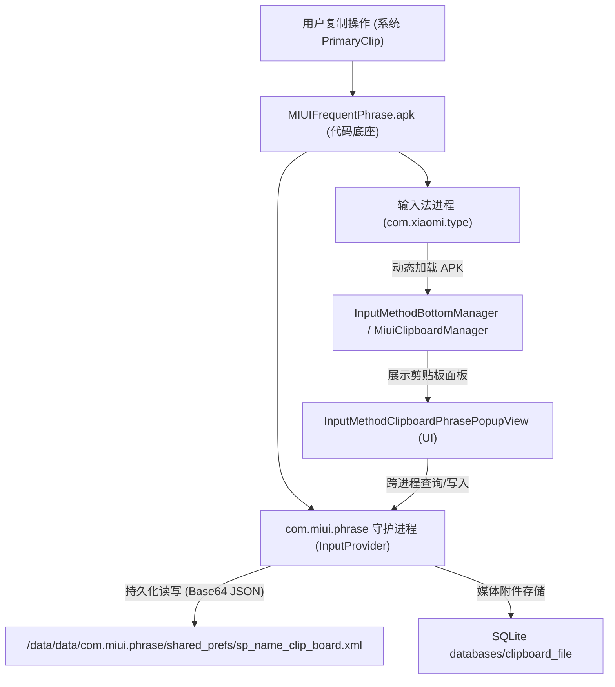

# MIUI/HyperOS 输入法剪贴板无限保存改造方案

## 1. 任务背景与核心诉求

在 Xiaomi HyperOS / MIUI 系统中，内置输入法（当前系统为 `com.xiaomi.type`，小米定制输入法）调用的系统剪贴板功能存在如下原生硬性限制：
1. **数量上限**：最多仅保存 **20 条** 历史记录，新增内容会将最旧记录顶掉；
2. **保存时限**：仅保存 **72 小时**（UI 提示为 72 小时，用户描述的 74 小时为近似记忆），过期内容被静默轮询删除；
3. **单条字符上限**：单条内容限制约 **20000 ~ 30000** 字符，超长内容被强制截断；
4. **持久化保障**：要求突破上述所有限制，达到**无限条数保存、永久不过期、即便是手机关机重启也不会丢失或自动清空**。

经过逆向提取与分析，该功能完全由系统核心组件 **`com.miui.phrase`（应用名：MIUIFrequentPhrase / 常用语与剪贴板）** 控制。

---

## 2. 深度逆向分析与机制定位

### 2.1 系统组件与交互架构

通过设备进程映射（Memory Maps）与反编译代码分析，MIUI 剪贴板的运行机制如下：



- **数据存储位置**：真实存储在磁盘文件 `/data/data/com.miui.phrase/shared_prefs/sp_name_clip_board.xml` 中的 `clipboard_cipher_list` 键值中，以 Base64 编码的 JSON 数组存储，包含条目内容、时间戳、类型等。
- **关机是否会删除的真相**：数据本身是在磁盘 SharedPreferences 中的，关机本身**并不会**被文件系统擦除。但为什么用户觉得“关机后自动清空”？
  1. 系统原生的 `ClipboardManager`（仅保留当前最后一次复制的内容）是在内存中，重启后清空；
  2. `com.miui.phrase` 在每次开机初始化 `InputProvider`、输入法面板打开、或新剪贴板写入时，都会执行**时间戳校验**，凡是与当前系统时间差值超过 72 小时的数据，直接从 JSON 数组中 `remove()` 并删除文件。若手机关机几天再开机，历史记录便在开机瞬间被全量清理。
  因此，只要彻底切除超时清理逻辑，剪贴板即可在磁盘中实现真正的“永久不删”。

---

### 2.2 关键限制代码精准定位（Smali 级）

通过对提取的 `MIUIFrequentPhrase.apk` 进行完整反汇编，定位到以下关键代码点：

#### 限制 1：72 小时超时自动删除
- **源码文件**：[`MiuiClipboardManager.java`](file:///C:/Users/limo2/AppData/Local/ReconBridge/work/com.miui.phrase/apk/MIUIFrequentPhrase-jadx/sources/com/miui/inputmethod/MiuiClipboardManager.java#L114) & [`N1/c.java`](file:///C:/Users/limo2/AppData/Local/ReconBridge/work/com.miui.phrase/apk/MIUIFrequentPhrase-jadx/sources/N1/c.java#L323)
- **定义常量**：`TWELVE_HOUR_TIME_INTERVAL:J = 0xf731400L`（259,200,000 毫秒 = 72 小时）。
- **判定位置 1 (`MiuiClipboardManager.smali:5148`)**：
  ```smali
  sub-long v5, p2, v3           # v5 = 当前时间 - 复制时间
  const-wide/32 v7, 0xf731400    # 72 小时
  cmp-long v7, v5, v7
  if-gtz v7, :cond_3            # 如果超时，跳转到 :cond_3 执行删除
  ```
- **判定位置 2 (`N1/c.smali:1106`)**：
  ```smali
  sub-long v12, v7, v12         # v12 = 当前时间 - 条目时间
  const-wide/32 v14, 0xf731400   # 72 小时
  cmp-long v14, v12, v14
  if-lez v14, :cond_0           # 如果超时，执行 it.remove() 删除
  ```

#### 限制 2：20 条数量上限
- **源码文件**：[`MiuiClipboardManager.java`](file:///C:/Users/limo2/AppData/Local/ReconBridge/work/com.miui.phrase/apk/MIUIFrequentPhrase-jadx/sources/com/miui/inputmethod/MiuiClipboardManager.java#L100)、[`N1/c.java`](file:///C:/Users/limo2/AppData/Local/ReconBridge/work/com.miui.phrase/apk/MIUIFrequentPhrase-jadx/sources/N1/c.java#L337)、[`InputMethodClipboardPhrasePopupView.java`](file:///C:/Users/limo2/AppData/Local/ReconBridge/work/com.miui.phrase/apk/MIUIFrequentPhrase-jadx/sources/com/miui/inputmethod/InputMethodClipboardPhrasePopupView.java#L429)
- **判定位置 1 (`MiuiClipboardManager.smali:5252`)**：
  在 `getNoExpiredClipboardData` 中读取历史记录时：
  ```smali
  invoke-virtual {v0}, Lorg/json/JSONArray;->length()I
  move-result v2
  const/16 v3, 0x14              # 20 条
  if-lt v2, v3, :cond_1         # 达到 20 条即 break 停止加载
  ```
- **判定位置 2 (`MiuiClipboardManager.smali:654`)**：
  在 `addContentListToJsonArray` 中合并列表时：
  ```smali
  const/16 v1, 0x14              # 20 条
  if-lt p3, v1, :cond_0         # 达到 20 条即截断
  ```
- **判定位置 3 (`N1/c.smali:1198`)**：
  在写入新剪贴板数据 `InputPhraseUtils.f` 时：
  ```smali
  const/16 v8, 0x14              # 20 条
  if-le v6, v8, :cond_5         # 若历史总数+当前 > 20，对列表执行 subList 裁剪弃掉多余项
  ```
- **判定位置 4 (`InputMethodClipboardPhrasePopupView.smali:1637`)**：
  在 UI 面板实时推送回调 `updateClipBoardData` 时：
  ```smali
  const/16 v2, 0x14              # 20 条
  if-lt v1, v2, :cond_1         # 超过 20 条直接移除尾部 item
  ```
- **判定位置 5 (`InputMethodClipboardPhrasePopupView.smali:1149`)**：
  跨设备流合并截断：`add-int/lit8 v2, v2, -0x14`。

#### 限制 3：单条字符长度上限
- **源码文件**：[`MiuiClipboardManager.java`](file:///C:/Users/limo2/AppData/Local/ReconBridge/work/com.miui.phrase/apk/MIUIFrequentPhrase-jadx/sources/com/miui/inputmethod/MiuiClipboardManager.java#L129)
- **定义常量**：`MAX_CLIP_CONTENT_SIZE:I = 0x7530`（30000 字符）。
- **判定位置 (`MiuiClipboardManager.smali:250, 5299`)**：
  通过 `sput v0, Lcom/miui/inputmethod/MiuiClipboardManager;->MAX_CLIP_CONTENT_SIZE:I` 进行设置，后续所有的 `maybeSubClipDataText`、`processSingleItemOfClipData` 都与该变量比对并进行 `substring` 截断。

#### 限制 4：顶部提示条文本
- **源码文件**：[`InputMethodClipboardHeaderAdapter.java`](file:///C:/Users/limo2/AppData/Local/ReconBridge/work/com.miui.phrase/apk/MIUIFrequentPhrase-jadx/sources/com/miui/inputmethod/InputMethodClipboardHeaderAdapter.java#L69)
- **位置 (`InputMethodClipboardHeaderAdapter.smali:90-108`)**：
  将 `0x14` (20), `0x48` (72), `0x4e20` (20000) 格式化填入 `input_method_clipboard_tips`，提示用户限制信息。

---

## 3. 技术路线选型与对比

| 对比维度 | 方案 A：APK Smali 硬改 + KernelSU 模块（推荐） | 方案 B：LSPosed Xposed Hook 模块 |
| :--- | :--- | :--- |
| **实现原理** | 直接修改 `MIUIFrequentPhrase.apk` 内字节码，通过 KernelSU `magic_mount` 替换 `/product/app/MIUIFrequentPhrase/` | 编写 Xposed 模块，Hook 内存中的方法与变量 |
| **生效范围** | **全系统彻底生效**，无论哪个输入法装载该组件都完全一致 | 依赖 LSPosed 勾选作用域（需同时勾选 `com.miui.phrase` 与 `com.xiaomi.type`） |
| **系统侵入性** | 模块化 Systemless 挂载，不破坏原系统分区，可随时停用模块秒恢复 | 需在系统常驻 Hook 框架，每次启动有微小反射开销 |
| **重启与持久化** | **极佳**，开机由 KernelSU 内核挂载，开机即生效，零失效可能 | 依赖 LSPosed 守护进程与 Zygote 注入，偶发冷启动失效风险 |
| **设备适配** | 设备已安装 **KernelSU + CorePatch 核心破解**，无需担心签名不一致问题 | 需要设备开启 LSPosed 并管理作用域 |

**决策**：采用 **方案 A（APK Smali 修改 + KernelSU 模块挂载）**，同时可利用 root 权限的 `mount --bind` 在**无需重启设备**的情况下瞬间热应用并进行实测验证。

---

## 4. 详细修改矩阵（Smali Patch Matrix）

我们将对提取的反编译 Smali 代码进行精准改写：

| 序号 | 目标文件 | 原指令逻辑 | 目标修改指令 | 效果说明 |
| :--- | :--- | :--- | :--- | :--- |
| **1** | `MiuiClipboardManager.smali` (常量) | `MAX_CLIPBOARD_LIST_SIZE = 0x14`<br>`TWELVE_HOUR_TIME_INTERVAL = 0xf731400L` | `MAX_CLIPBOARD_LIST_SIZE = 0x7fffffff`<br>`TWELVE_HOUR_TIME_INTERVAL = 0x7fffffffffffffffL` | 解除类内定义的限制常量 |
| **2** | `MiuiClipboardManager.smali` (单条字数) | `const/16 v3, 0x7530`<br>`sput v3, ...MAX_CLIP_CONTENT_SIZE` | `const v3, 0x7fffffff`<br>`sput v3, ...MAX_CLIP_CONTENT_SIZE` | 单条字符上限改为 21 亿（完全不截断） |
| **3** | `MiuiClipboardManager.smali` (读取容量) | `const/16 v3, 0x14`<br>`if-lt v2, v3, :cond_1` | `const v3, 0x7fffffff`<br>`if-lt v2, v3, :cond_1` | `getNoExpiredClipboardData` 达到 20 条不再中断 |
| **4** | `MiuiClipboardManager.smali` (超时检测) | `const-wide/32 v7, 0xf731400`<br>`if-gtz v7, :cond_3` | `const-wide v7, 0x7fffffffffffffffL`<br>`if-gtz v7, :cond_3` | 时间差永远无法超过 Long.MAX_VALUE，绝不超时 |
| **5** | `MiuiClipboardManager.smali` (合并容量) | `const/16 v1, 0x14`<br>`if-lt p3, v1, :cond_0` | `const v1, 0x7fffffff`<br>`if-lt p3, v1, :cond_0` | `addContentListToJsonArray` 允许多条合并 |
| **6** | `N1/c.smali` (存储超时检测) | `const-wide/32 v14, 0xf731400`<br>`if-lez v14, :cond_0` | `const-wide v14, 0x7fffffffffffffffL`<br>`if-lez v14, :cond_0` | 写入新内容时不再清理超过 72 小时的旧内容 |
| **7** | `N1/c.smali` (存储截断旧内容) | `const/16 v8, 0x14`<br>`if-le v6, v8, :cond_5` | `const v8, 0x7fffffff`<br>`if-le v6, v8, :cond_5` | 写入新内容时永不执行 `subList` 截断丢弃旧内容 |
| **8** | `InputMethodClipboardPhrasePopupView.smali` | `const/16 v2, 0x14`<br>`if-lt v1, v2, :cond_1` | `const v2, 0x7fffffff`<br>`if-lt v1, v2, :cond_1` | 界面实时追加剪贴板时永不裁减底部条目 |
| **9** | `InputMethodClipboardHeaderAdapter.smali` | 格式化输出 (20, 72, 20000) | `const-string p2, "已解除限制：永久无限保存 / 无限字符"` | 顶部提示条清晰显示已破解状态 |

---

## 5. 实施与部署步骤规划

### 阶段一：代码修改与 APK 重新打包
1. **执行 Smali 替换**：编写专用 Python 补丁脚本，对 `apktool-out/smali` 中的上述文件进行精准替换，并做 AST/正则比对校验；
2. **Apktool 回编译**：使用已就绪的 `apktool_2.10.0.jar` 将修改后的 Smali 编译为新的 `classes.dex`，生成目标 APK；
3. **Zipalign 与签名**：
   - 使用 `E:\Android\Sdk\build-tools\36.1.0\zipalign.exe -p -f 4` 对 APK 进行 4 字节对其；
   - 使用 `apksigner.bat` 与本地 debug keystore 完成签名。

### 阶段二：KernelSU 模块制作与部署
1. 在设备端 `/data/adb/modules/miui_unlimited_phrase` 构建标准化模块结构：
   ```text
   /data/adb/modules/miui_unlimited_phrase/
   ├── module.prop
   ├── system/
   │   └── product/
   │       └── app/
   │           └── MIUIFrequentPhrase/
   │               └── MIUIFrequentPhrase.apk
   ```
2. 写入 `module.prop` 并在系统重启时由 `magic_mount_rs` 自动无感覆盖。

### 阶段三：即时热生效与功能验证（免重启首轮测试）
1. **热加载测试**：
   - 将新 APK 传至设备 `/data/local/tmp/MIUIFrequentPhrase_patched.apk`；
   - 使用 root 执行 `mount -o bind /data/local/tmp/MIUIFrequentPhrase_patched.apk /product/app/MIUIFrequentPhrase/MIUIFrequentPhrase.apk`；
   - `kill` 杀死当前的 `com.xiaomi.type`（输入法进程自动重启并重新加载新 APK）与 `com.miui.phrase`。
2. **多场景验证**：
   - **数量突破测试**：连续复制超过 25 条不同文本，呼出输入法剪贴板面板，确认超过 20 条全部存在，不再发生旧内容被顶掉；
   - **单条长文本测试**：复制超过 30000 字符的大段文本，粘贴并确认未被截断；
   - **UI 提示测试**：确认顶部提示条已变更为无限制状态；
   - **重启持久化测试**：手机重启后，确认 KernelSU 模块正常挂载，历史所有剪贴板记录完整无损保留。

---

## 6. 风险评估与应急回滚方案

- **风险等级**：**极低**。
- **安全保障**：
  1. 所有修改走 KernelSU 的 Systemless 挂载，未对 `/product` 物理只读分区做任何直接写入修改；
  2. 随时可通过删除 `/data/adb/modules/miui_unlimited_phrase` 目录或执行 `umount /product/app/MIUIFrequentPhrase/MIUIFrequentPhrase.apk` 瞬间 100% 还原为官方原始状态；
  3. 设备已安装 CorePatch，杜绝了签名不一致引起的闪退或拒绝运行问题；
  4. 原始官方 APK 已在 PC 工作区完成完整备份。
